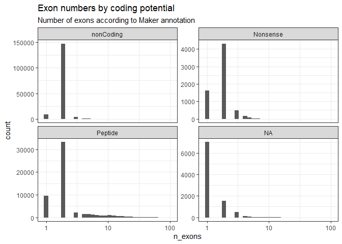

superTranscripts
================
Jeronimo Miranda
2024-04-01

## Exon-intron structure of the D. laeve transcriptome

We followed two approaches to get splicing information, both of them
imperfect.

- 1 Trinity offers a functionality to identify [super
  transcripts](https://github.com/trinityrnaseq/trinityrnaseq/wiki/SuperTranscripts).
  This comes with the caveat that: \>Note, while supertranscripts are
  useful for exploring transcript characteristics in the absence of a
  reference genome, there is noise and bias that should be taken into
  consideration.

This data is in the object `consolidated_transcript`

- 2 Maker annotation using the transcriptome as EST evidence and the
  Biomphalaria proteome. This is a genome annotation pipeline that maps
  proteins and transcripts back to the Genomic sequence. The main biases
  and limitations of this approach are: the genome is not completely
  assembled, but consists of +7000 contigs, which, although they capture
  most of the genomic sequence, might not all be useful to annotate
  exons over long distances. Maker mostly annotates genes with
  protein-coding potential. This is contained in the object
  `maker_exons`. It has up to 200,000 transcripts, although, when trying
  to compare them to TRINITY, they are most conserved to a subset of
  40,000 TRINITY transcripts.

### Number of exons according to trinity

It is clear that the most transcripts have only one exon. This trend
continues when dividing the transcripts by their coding potential. So
that, when taking into account all peptide coding transcripts with more
than one exon, they are more than the single exons. This characteristic
is in line with all other properties between transcripts classes.

``` r
ggplot(consolidated_transcript) + geom_histogram(aes(number_of_exons)) + scale_x_log10() + theme_bw() + labs(title = "The vast majority of TRINITY transcripts are single exon")
```

<!-- -->

``` r
ggplot(consolidated_transcript) + geom_histogram(aes(number_of_exons)) + scale_x_log10() + theme_bw() + labs(title = "The vast majority of non-coding TRINITY transcripts are single exon") + facet_wrap(~rna_type, scales = "free_y")
```

<!-- -->

## Maker exons

We join the information of the maker transcripts with the TRINITY
transcripts, we do this by joining the tables by giving the maker
transcripts their identity through blast hits. Therefore, many maker
transcripts can correspond to the same TRINITY ID. In total, only around
40,000 TRINITY transcripts are represented in the maker dataset, even
though the maker dataset consists of more than 200,000 transcripts.

    ## `stat_bin()` using `bins = 30`. Pick better value with `binwidth`.

<!-- -->

Note that the `echo = FALSE` parameter was added to the code chunk to
prevent printing of the R code that generated the plot.
